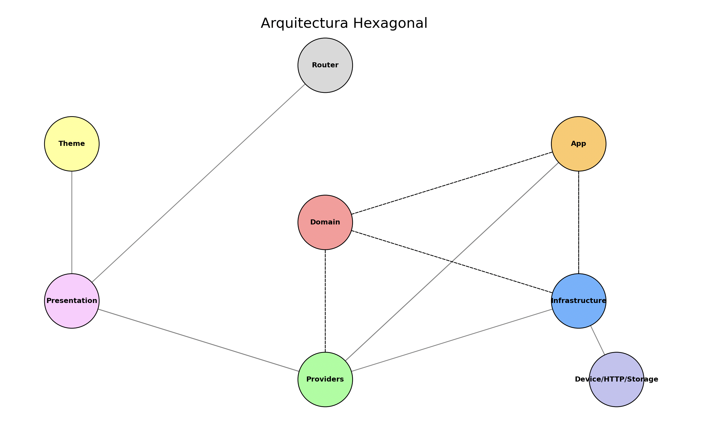

### README.md

# Boilerplate App - v1.0.0

Bienvenido al proyecto **`boilerplate-app`**, una base sólida para el desarrollo de aplicaciones web modernas. Este sistema está construido con **Vite**, diseñado para ser modular, escalable y mantenible. Utiliza una **arquitectura hexagonal** (Ports and Adapters) que garantiza el desacoplamiento entre capas y facilita la evolución del sistema.

## Tabla de Contenidos

1. [Descripción del Proyecto](#descripción-del-proyecto)
2. [Requisitos Previos](#requisitos-previos)
3. [Configuración del Entorno](#configuración-del-entorno)
4. [Estructura del Proyecto](#estructura-del-proyecto)
5. [Arquitectura del Proyecto](#arquitectura-del-proyecto)
6. [Pruebas](#pruebas)
7. [Documentación](#documentación)
8. [Contribuir al Proyecto](#contribuir-al-proyecto)
9. [Recursos Adicionales](#recursos-adicionales)

---

## Descripción del Proyecto

El **Boilerplate App** proporciona una base sólida para proyectos de React, optimizada en rendimiento y escalabilidad. Está configurado para ofrecer:

- Modularidad y escalabilidad gracias a su **arquitectura hexagonal**.
- Pruebas robustas mediante **Testing Library** (unitarias) y **Cypress** con **Cucumber** (end-to-end).
- Documentación visual de componentes con **Storybook**.
- Componentes reutilizables y personalizables con [Shadcn/ui](https://ui.shadcn.com/).

---

## Requisitos Previos

Para trabajar en este proyecto, necesitas tener instalados los siguientes programas:

- **Node.js**: versión 14 o superior. Se recomienda usar [nvm](https://github.com/nvm-sh/nvm) para manejar múltiples versiones de Node.js.
- **npm** o **yarn**: Gestores de paquetes para npm.
- **Git**: Sistema de control de versiones para el flujo de trabajo colaborativo.

---

## Configuración del Entorno

1. **Clona el repositorio**:

   ```bash
   git clone https://github.com/psbarrales/boilerplate-react-app.git
   cd boilerplate-app
   ```

2. **Instala las dependencias**:

   ```bash
   npm install
   # o
   yarn install
   ```

3. **Configura las variables de entorno** según tus necesidades. Puedes crear un archivo `.env` basado en `.env.example` (si existe):

   ```bash
   cp .env.example .env
   ```

   Edita el archivo `.env` para definir variables necesarias para el proyecto, como claves de Firebase.

4. **Ejecuta el proyecto en modo desarrollo**:

   ```bash
   npm run dev
   # o
   yarn dev
   ```

5. **Accede a la aplicación** en tu navegador en `http://localhost:5173/`.

---

## Estructura del Proyecto

El proyecto sigue una estructura organizada para facilitar la comprensión y el mantenimiento. Aquí tienes una descripción detallada de cada carpeta:

- **`/src`**: Contiene el código fuente principal de la aplicación.
  - **`components.json`**: Configuración de los componentes.
  - **`routes`**: Definición de rutas de la aplicación.
  - **`presentation`**: Componentes de presentación (Vistas).
  - **`application`**: Casos de uso y lógica de negocio.
  - **`domain`**: Definición de modelos y puertos.
  - **`infrastructure`**: Implementación de puertos y configuración de integraciones externas.
  - **`providers`**: Componentes y hooks para manejar el estado global y proveedores.
  - **`theme`**: Definición de estilos y temas.
  - **`tests`**: Pruebas unitarias e integradas.
  - **`assets`**: Archivos estáticos (imágenes, fuentes, etc.).
- **`public`**: Archivos no procesados por Webpack/Vite.
- **`docs`**: Documentación del proyecto.
- **`cypress`**: Configuración y pruebas E2E.
- **`stories`**: Definición de historias para Storybook.
- **Otros archivos de configuración**: `vite.config.ts`, `tsconfig.json`, `package.json`, etc.

Para una explicación detallada de la estructura y cómo interactúan las capas, consulta [docs/Arquitectura.md](docs/Arquitectura.md).

---

## Arquitectura del Proyecto

El proyecto utiliza una **arquitectura hexagonal** (Ports and Adapters) que separa lógica de negocio, infraestructura y interfaz de usuario. Esto facilita el mantenimiento, las pruebas y la implementación de nuevas funcionalidades.



Para una explicación completa de las carpetas y cómo interactúan las capas, consulta [docs/Arquitectura.md](docs/Arquitectura.md).

---

## Pruebas

El proyecto cuenta con un sistema robusto de pruebas unitarias e integradas para garantizar la calidad del código y facilitar el mantenimiento.

### Pruebas Unitarias

Utiliza **Testing Library** para pruebas unitarias de componentes React.

1. Ejecuta las pruebas unitarias:

   ```bash
   npm run test
   # o
   yarn test
   ```

### Pruebas E2E

Utiliza **Cypress** con **Cucumber** para pruebas end-to-end.

1. Inicia el servidor de desarrollo y ejecuta las pruebas E2E:

   ```bash
   npm run test.e2e
   # o
   yarn test.e2e
   ```

2. Abre una interfaz interactiva para las pruebas E2E:

   ```bash
   npm run test.e2e:open
   # o
   yarn test.e2e:open
   ```

### Storybook

**Storybook** permite visualizar y probar componentes en aislamiento.

1. Ejecuta Storybook para ver los componentes en acción:

   ```bash
   npm run storybook
   # o
   yarn storybook
   ```

---

## Documentación

### Arquitectura del Proyecto

Consulta el [archivo de arquitectura](docs/Arquitectura.md) para obtener una explicación detallada de la estructura del proyecto y la interacción entre sus distintas capas.

- **Capas**:
  - **Infraestructura**: Implementación de puertos y configuración de integraciones externas (Firebase, Capacitor, etc.).
  - **Dominio**: Definición de modelos y puertos.
  - **Aplicación**: Casos de uso y lógica de negocio.
  - **Presentación**: Componentes de la interfaz de usuario.
  - **Interfaz de Usuario**: Integración de componentes, lógica de negocio y presentación.

### Guía de Contribución

Consulta el [README de contribución](docs/Contribución.md) para obtener instrucciones sobre cómo colaborar y mantener el código consistente.

---

## Agregar Componentes Shadcn

Este proyecto incluye componentes pre-configurados de [Shadcn/ui](https://ui.shadcn.com/), una biblioteca de componentes elegantes y accesibles construidos con Radix UI y Tailwind CSS.

### Cómo añadir componentes Shadcn

1. **Instala un componente** usando el CLI de Shadcn:

   ```bash
   npx shadcn-ui@latest add button
   ```

2. **Usa el componente** en tu código:

   ```jsx
   import { Button } from "@components/ui/button";

   export function MyComponent() {
     return (
       <div className="container mx-auto py-10 px-4">
         <Button>Click me</Button>
       </div>
     );
   }
   ```

3. **Personaliza los componentes** editando sus archivos en `src/theme/components/lib/`.

Los componentes de Shadcn son altamente personalizables y no tienen dependencias de runtime, lo que los hace ideales para este boilerplate. Consulta la [documentación oficial de Shadcn](https://ui.shadcn.com/docs) para más detalles.

---

## Resumen de Scripts

Aquí hay una lista de los scripts disponibles en el proyecto y su descripción:

- **`dev`**: Ejecuta el proyecto en modo desarrollo.
- **`build`**: Compila el proyecto.
- **`preview`**: Vista previa de la aplicación compilada.
- **`test`**: Ejecuta las pruebas unitarias.
- **`test.e2e`**: Ejecuta las pruebas end-to-end.
- **`test.e2e:open`**: Abre una interfaz interactiva para las pruebas end-to-end.
- **`lint`**: Ejecuta analizadores de código estático.
- **`storybook`**: Inicia Storybook para desarrollar componentes en aislamiento.
- **`build-storybook`**: Construye la documentación de Storybook.
- **`type-check`**: Ejecuta el chequeo de tipos de TypeScript.
- **`validate`**: Ejecuta el chequeo de tipos y lints.

---

## Contribuir al Proyecto

Las contribuciones son bienvenidas. Sigue los pasos descritos en [docs/Contribución.md](docs/Contribución.md) para asegurarte de que tu contribución sea aceptada.

**Resumen de pasos para contribuir:**

1. Haz un fork del repositorio.
2. Crea una rama para tu funcionalidad o corrección.
3. Realiza tus cambios y asegúrate de que todas las pruebas pasen.
4. Abre un Pull Request hacia la rama `main`.

---

## Recursos Adicionales

- **[Documentación de React](https://es.reactjs.org/docs/getting-started.html)**: Guía oficial para empezar con React.
- **[Vite](https://vitejs.dev/guide/)**: Documentación de Vite, el empaquetador de código.

- **[Pruebas Unitarias con Testing Library](https://testing-library.com/docs/react-testing-library/intro)**: Guía para realizar pruebas unitarias en tu aplicación.
- **[Pruebas E2E con Cypress](https://docs.cypress.io/guides/core-concepts/introduction)**: Documentación para realizar pruebas end-to-end.
- **[Componentes Shadcn](https://ui.shadcn.com/)**: Documentación y guía para usar componentes desde Shadcn/ui.
- **[Storybook](https://storybook.js.org/docs/react/get-started/introduction)**: Guía para trabajar con Storybook.
- **[Arquitectura](docs/Arquitectura.md)**: Descripción detallada de la estructura y responsabilidades de cada carpeta del proyecto.
- **[Contribución](docs/Contribución.md)**: Instrucciones para contribuir al proyecto.
- **[Repositorio](https://github.com/psbarrales/boilerplate-react-app)**: Página oficial del repositorio.

---

¡Gracias por utilizar **Boilerplate App**! Tu colaboración es clave para su éxito.

---

## Licencia

Este proyecto está licenciado bajo la **MIT License**. Consulta el archivo [LICENSE](./LICENSE) para obtener más detalles.

---

¡Excelente! Esperamos que encuentres útil este boilerplate para tus proyectos futuros. ¡No dudes en comunicarte con la comunidad y contribuir al crecimiento del repositorio! 😊

---

**Desarrollado con ❤️ por la comunidad**

---

---

¡Gracias por utilizar **Boilerplate App**! Tu colaboración es clave para su éxito.

---

## Estructura del Proyecto

La estructura del proyecto está organizada de manera que sea fácil de entender y mantener. Aquí te presentamos una descripción detallada de cada carpeta:

- **`/src`**: Contiene el código fuente principal de la aplicación.
  - **`assets`**: Archivos estáticos como imágenes y fuentes.
  - **`components.json`**: Configuración de los componentes utilizados en el proyecto.
  - **`domain`**: Define models, puertos y lógica de negocio.
    - **`models`**: Entidades y interfaces del dominio.
    - **`ports`**: Puertos de entrada y salida para interactuar con la aplicación.
  - **`infrastructure`**: Implementación de puertos y configuración de integraciones externas.
    - **`api`**: Implementación de puertos de API.
    - **`capacitor`**: Adaptadores para Capacitor.
    - **`firebase`**: Adaptadores para Firebase.
  - **`presentation`**: Componentes de la interfaz de usuario y vistas.
    - **`pages`**: Páginas de la aplicación.
  - **`providers`**: Mecanismos para manejar estado y proveedores.
  - **`routes`**: Definición de rutas y guardas de ruta.
- **`public`**: Archivos estáticos no procesados por Webpack/Vite.
- **`docs`**: Documentación del proyecto.
- **`cypress`**: Configuración y pruebas end-to-end.
- **`stories`**: Definición de historias para Storybook.
- **Otros archivos de configuración**: `vite.config.ts`, `tsconfig.json`, `babel.config.json`, etc.

---

## Licencia

Este proyecto está licenciado bajo la **MIT License**. Consulta el archivo [LICENSE](./LICENSE) para obtener más detalles.

---

¡Gracias por utilizar **Boilerplate App**! Tu colaboración es clave para su éxito.

---

**Desarrollado con ❤️ por la comunidad**

```